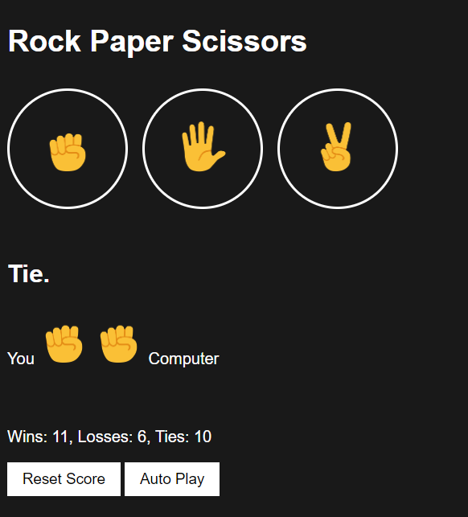

# ROCK-PAPER-SCISSORS Game

## Table of Contents

- [Introduction](#introduction)
- [Folder Structure](#folder-structure)
- [Features](#features)
- [How to Play](#how-to-play)
- [Styling](#styling)
- [Author](#author)
- [License](#license)

## Introduction

Welcome to the ROCK-PAPER-SCISSOR game! This simple web-based game allows you to play the classic Rock, Paper, Scissors game against a computer. The game provides both manual and auto-play modes and keeps track of your score.

## Folder Structure

The project is organized into the following folder structure:

- **IMAGES**: This folder contains hand emojis for Rock, Paper, and Scissors used in the game.

- **STYLES**: This folder contains the CSS file that styles the game interface.
  - `rock-paper-scissors.css`: Defines the styling for the game elements.

- **SCRIPTS**: This folder contains the JavaScript file that provides the game logic and interactivity.
  - `rock-paper-scissors.js`: Implements the game logic and handles user interactions.

- `rock-paper-scissors.html`: The main HTML file that defines the game's structure and elements.

## Features

- Play Rock, Paper, Scissors against a computer.
- Keep track of your score (wins, losses, ties).
- Option to play manually or enable auto-play.
- Reset the score to start over.

## How to Play

1. Open `rock-paper-scissors.html` in a web browser to start the game.

### Manual Play

- Click the "Rock," "Paper," or "Scissors" buttons to make your move.
- The game result will be displayed, and your score will be updated.

### Auto-Play

- Click the "Auto Play" button to start or stop auto-play mode.
- In auto-play mode, the computer will make random moves every second.

### Keyboard Shortcuts

- Use keyboard shortcuts for quick play:
  - Press `r` for Rock.
  - Press `p` for Paper.
  - Press `s` for Scissors.
  - Press `a` to toggle Auto Play.
  - Press `Backspace` to reset the score (confirmation will be displayed).

## Styling

The game features a dark-themed interface with white text and circular buttons. The styling is defined in the `rock-paper-scissors.css` file.

## Author

- Akshay Kunchalapalli

## License

This project is licensed under the MIT License - see the [LICENSE.md](LICENSE.md) file for details.

Enjoy the game!
